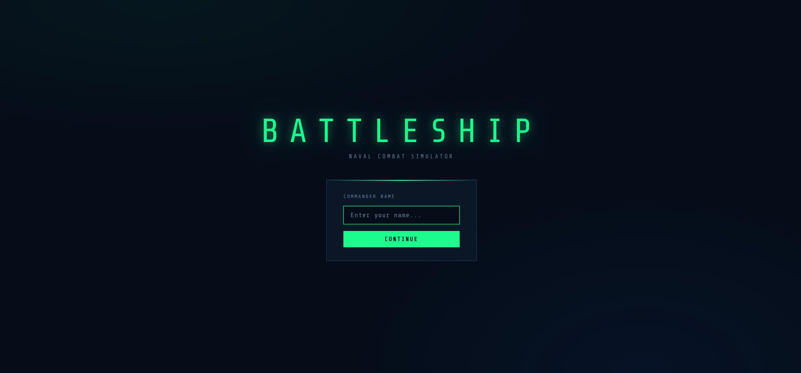
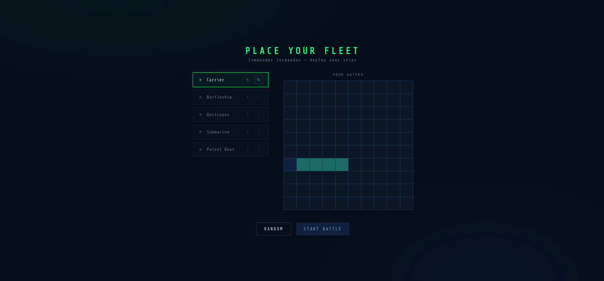
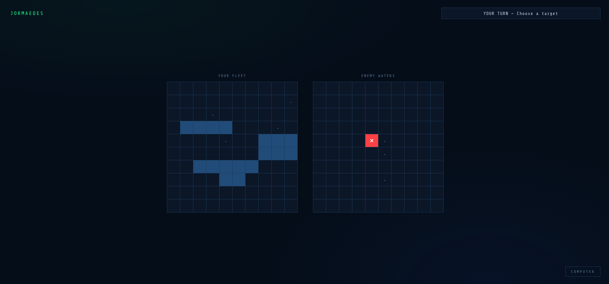

# ⚓ Battleship

A browser-based implementation of the classic naval combat game, built with vanilla JavaScript using Test Driven Development (TDD).

🔗 **[Play Live](https://jormaedes.github.io/battleship/)**

---

## Preview





---

## How to Play

1. **Setup** — Enter your commander name
2. **Deploy your fleet** — Place your 5 ships on the grid:
   - Use the **↻** button to rotate between horizontal and vertical
   - Hover over the grid to preview placement
   - Or click **RANDOM** to auto-place all ships
3. **Battle** — Click on the enemy grid to fire
4. The game alternates between your move and the computer's
5. First to sink all enemy ships wins

### Fleet

| Ship | Size |
|---|---|
| Carrier | 5 |
| Battleship | 4 |
| Destroyer | 3 |
| Submarine | 3 |
| Patrol Boat | 2 |

---

## Getting Started

```bash
# Clone the repository
git clone https://github.com/jormaedes/battleship.git
cd battleship

# Install dependencies
npm install

# Start development server
npm run dev

# Run tests
npm run test

# Build for production
npm run build
```

---

## Technologies

- **JavaScript (ES6+)** — Classes, modules, private fields
- **Webpack** — Bundling and dev server
- **Babel** — ESM/CJS conversion for Jest
- **Jest** — Unit testing (TDD)
- **CSS3** — Custom properties, Grid, animations

---

## Future Improvements

- [ ] Drag & drop ship placement
- [ ] Smarter computer AI (target adjacent cells after a hit)
- [ ] Avatar selection
- [ ] Dark / Light theme toggle
- [ ] Sound effects
- [ ] 2-player mode (pass device)

---

## Author

**Jormaedes Luís** — [@jormaedes](https://github.com/jormaedes)

*Built as part of [The Odin Project](https://www.theodinproject.com/lessons/node-path-javascript-battleship) curriculum.*